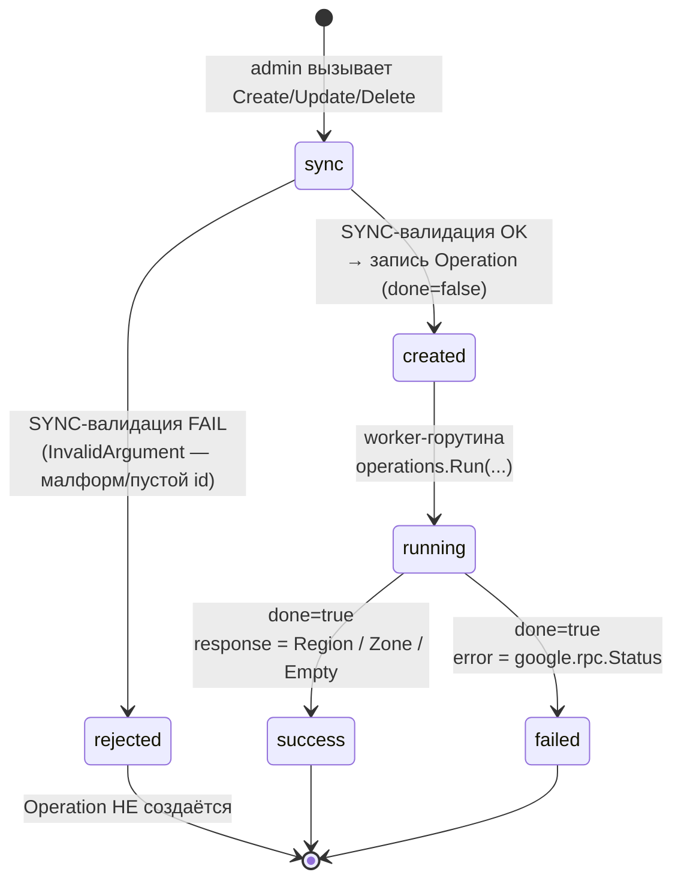

import { ApiOperation } from '@site/src/components/commonBlocks/ApiOperation'
import CodeBlock from '@theme/CodeBlock'
import dedent from 'ts-dedent'

# Operations (LRO)

## Зачем нужна модель Operation

Наполнение и правка каталога топологии — это не мгновенный факт, а **намерение**, которое
сервис исполняет: завести регион, создать зону, снять регион (с проверкой, что зон под ним
не осталось). Чтобы admin-клиент не блокировался на время исполнения и всегда мог узнать «что
в итоге получилось», Kachō вводит единую абстракцию — **Operation** (Long-Running Operation,
LRO). Admin-мутация сразу возвращает «квитанцию» с идентификатором операции (`done: false`), а
результат (или ошибку) клиент забирает позже, опрашивая операцию по её `id`. Квитанция durable:
она хранится в таблице `operations` базы `kacho_geo`, переживает рестарт сервиса, а повторное
чтение идемпотентно.

**Operation** — асинхронная долгоиграющая операция. Каждая **admin-мутация** Kachō Geo
(`InternalRegionService` / `InternalZoneService` `Create` / `Update` / `Delete`) выполняется
**не синхронно**: RPC сразу возвращает `Operation`-envelope с `done: false`, а реальная запись
в БД идёт в worker-горутине. Клиент **поллит** статус операции, пока не получит `done: true`.

:::info Почему так — единая конвенция Kachō
Синхронный возврат ресурса из мутирующего RPC противоречит конвенциям Kachō (мутации →
`Operation`). Read-RPC (`RegionService` / `ZoneService` Get/List) остаются **синхронными** —
это чтение справочника. Асинхронна только admin-запись каталога.
:::

## Структура Operation

`Operation` (`kacho.cloud.operation.v1.Operation`) — плоский envelope с полем-результатом в
виде `oneof`:

<table>
  <thead><tr><th>Поле</th><th>Тип</th><th>Описание</th></tr></thead>
  <tbody>
    <tr><td><code>id</code></td><td>string</td><td>Идентификатор операции. Kachō Geo использует выделенный 3-символьный префикс <code>geo</code> (декаплен от id ресурсов; по нему api-gateway маршрутизирует <code>OperationService.Get</code> в backend kacho-geo)</td></tr>
    <tr><td><code>description</code></td><td>string</td><td>Человекочитаемое описание (например <code>create region</code>)</td></tr>
    <tr><td><code>createdAt</code></td><td>timestamp</td><td>Момент постановки операции (усечён до секунд)</td></tr>
    <tr><td><code>done</code></td><td>bool</td><td><code>false</code> — операция ещё выполняется; <code>true</code> — завершена, выставлен ровно один из <code>error</code> / <code>response</code></td></tr>
    <tr><td><code>metadata</code></td><td><code>google.protobuf.Any</code></td><td>Метадата операции — id целевого ресурса (<code>CreateRegionMetadata.regionId</code>, <code>CreateZoneMetadata.zoneId</code> и т.д.). Доступна сразу, ещё до завершения</td></tr>
    <tr><td><code>error</code></td><td><code>google.rpc.Status</code></td><td>Результат при неудаче: <code>&#123;code, message, details[]&#125;</code>. Часть <code>oneof result</code></td></tr>
    <tr><td><code>response</code></td><td><code>google.protobuf.Any</code></td><td>Результат при успехе: <code>Region</code> / <code>Zone</code> (для Create/Update) либо <code>google.protobuf.Empty</code> (для Delete). Часть <code>oneof result</code></td></tr>
  </tbody>
</table>

:::note Инвариант oneof result
Пока `done: false` — **ни** `error`, **ни** `response` не заполнены. При `done: true` —
выставлен **ровно один** из них. Клиент сначала проверяет `done`, затем — какая ветвь `oneof`
заполнена.
:::

Поля `createdBy` / `principalType` / `principalId` / `principalDisplayName` идентифицируют
администратора, инициировавшего операцию (заполняются auth-интерцептором из доверенного
identity). Они же определяют **владельца** операции — см. ниже.

## Жизненный цикл

**Синхронные** ошибки (малформ / пустой id) возвращаются **сразу как gRPC-ошибка** —
`Operation` при этом **не создаётся**. **Асинхронные** ошибки — нарушение FK при удалении
региона с зонами (`FAILED_PRECONDITION`), PK-конфликт при Create (`ALREADY_EXISTS`), ссылка на
несуществующий регион (`FAILED_PRECONDITION`) — фиксируются **внутри** уже созданной операции в
поле `error` при `done: true`.

## OperationService.Get

<ApiOperation method="GET" endpoint="/operations/{operationId}">

Возвращает текущее состояние операции по её идентификатору — синхронный read, основа паттерна
поллинга. Маршрутизация в backend идёт по 3-символьному префиксу `id` (`geo…` → kacho-geo).
Доступ — **только владельцу** операции (см. ниже); чужой / несуществующий id → одинаковый
`NOT_FOUND`.

<CodeBlock language="bash">
  {dedent`
    curl 'http://localhost:18080/operations/{operationId}' \\
      -H 'Authorization: Bearer <admin-JWT>'
  `}
</CodeBlock>

Операция ещё выполняется:

<CodeBlock language="json">
  {dedent`
    {
      "id": "{operationId}",
      "description": "create zone",
      "createdAt": "2026-06-24T10:05:00Z",
      "done": false,
      "metadata": {
        "@type": "type.googleapis.com/kacho.cloud.geo.v1.CreateZoneMetadata",
        "zoneId": "region-1-c"
      }
    }
  `}
</CodeBlock>

Операция завершена успешно (ветвь `response` — созданный ресурс):

<CodeBlock language="json">
  {dedent`
    {
      "id": "{operationId}",
      "description": "create zone",
      "createdAt": "2026-06-24T10:05:00Z",
      "modifiedAt": "2026-06-24T10:05:01Z",
      "done": true,
      "metadata": {
        "@type": "type.googleapis.com/kacho.cloud.geo.v1.CreateZoneMetadata",
        "zoneId": "region-1-c"
      },
      "response": {
        "@type": "type.googleapis.com/kacho.cloud.geo.v1.Zone",
        "id": "region-1-c",
        "regionId": "region-1",
        "status": "UP",
        "name": "Region 1, zone C",
        "createdAt": "2026-06-24T10:05:01Z"
      }
    }
  `}
</CodeBlock>

Операция завершена с ошибкой (ветвь `error`):

<CodeBlock language="json">
  {dedent`
    {
      "id": "{operationId}",
      "description": "delete region",
      "createdAt": "2026-06-24T10:06:00Z",
      "modifiedAt": "2026-06-24T10:06:00Z",
      "done": true,
      "metadata": {
        "@type": "type.googleapis.com/kacho.cloud.geo.v1.DeleteRegionMetadata",
        "regionId": "region-1"
      },
      "error": {
        "code": 9,
        "message": "Region region-1 violates a reference constraint",
        "details": []
      }
    }
  `}
</CodeBlock>

</ApiOperation>

## OperationService.Cancel

<ApiOperation method="POST" endpoint="/operations/{operationId}:cancel">

Запрашивает отмену ещё выполняющейся операции и возвращает её обновлённое состояние. Отменить
можно только операцию с `done: false`; попытка отменить уже завершённую отклоняется. Доступ —
**только владельцу**. Маршрутизация — по тому же префиксу `id` (`geo…` → kacho-geo).

<CodeBlock language="bash">
  {dedent`
    curl -X POST 'http://localhost:18080/operations/{operationId}:cancel' \\
      -H 'Authorization: Bearer <admin-JWT>'
  `}
</CodeBlock>

:::caution Отмена уже завершённой операции
Операция в состоянии `done: true` неотменяема — повторный `Cancel` вернёт
`FAILED_PRECONDITION "operation <id> already completed"`. Чужой / несуществующий `id` →
`NOT_FOUND` (owner-скоуп, без раскрытия существования).
:::

</ApiOperation>

## Владелец операции и no-leak

`OperationService.Get` / `Cancel` **освобождены** от per-RPC ReBAC-Check (в proto —
`permission: "<exempt>"`): `operationId` opaque, но это прямая object-reference. Вместо
ReBAC доступ ограничен **владельцем** — принципалом, создавшим операцию (колонки
`principal_*` LRO-строки, проставляются из доверенного ctx при Create). Предикат владельца
энфорсится в SQL (`GetOwned` / `CancelOwned` — within-service инвариант на DB-уровне, без
software-TOCTOU).

Чужой или несуществующий `id` отдают **одинаковый** `NOT_FOUND` — «есть, но не твоя»
неотличимо от «нет такой» (не создаём existence-oracle). В Kachō Geo нет tenant/admin-обхода:
все admin-мутации и так требуют `system_admin`, а операция принадлежит своему создателю-админу —
owner-скоуп строгий.

## Durable-восстановление осиротевших операций

Если сервис упал между «записал `Operation (done=false)`» и «worker финализировал строку»,
операция остаётся осиротевшей (`done=false` без активного worker'а). Фоновый reconciler
(движок — `kacho-corelib/operations`, доменная часть — resolver kacho-geo) периодически
сканирует такие строки и приводит их статус в соответствие с committed-реальностью ресурса:

- метадата **Create** — ресурс присутствует → `done` (response = текущий ресурс); отсутствует →
  прервана;
- метадата **Update** — присутствует → `done` (текущий ресурс); отсутствует → прервана;
- метадата **Delete** — отсутствует → `done` (Empty); присутствует → прервана.

Reconciler не перезапускает worker — он лишь синхронизирует статус операции с тем, что реально
закоммичено (writer-транзакция атомарна, частичных состояний нет).

## Паттерн поллинга

Клиент опрашивает `GET /operations/{operationId}` с небольшим интервалом, пока не увидит
`done: true`, после чего читает результат из соответствующей ветви `oneof` (`response` при
успехе, `error` при неудаче). Watch-RPC в Kachō не существует — только поллинг.

<CodeBlock language="bash">
  {dedent`
    # POST-мутация вернула { "id": "geo…", "done": false }
    # поллим операцию до done=true
    curl 'http://localhost:18080/operations/geoXXXXXXXXXXXXXXXX' \\
      -H 'Authorization: Bearer <admin-JWT>'
  `}
</CodeBlock>
