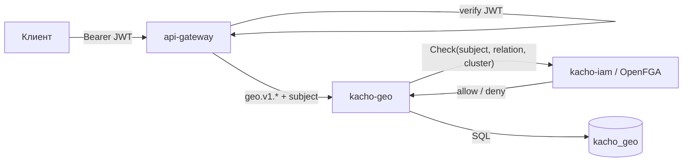

import CodeBlock from '@theme/CodeBlock'
import dedent from 'ts-dedent'

# Обзор API

Эта страница описывает **конвенции**, общие для всего API Kachō Geo: ресурсы и поверхности,
два порта (public / internal), REST-пути, формат JSON, аутентификацию и авторизацию, формат
ошибок, пагинацию и точность временных меток. Конкретные поля и операции каждого ресурса — на
отдельных страницах ([Region](/api/region), [Zone](/api/zone)).

:::info Единый контракт — gRPC, REST — проекция
Источник истины — Protocol Buffers в `kacho-proto` (домен `kacho.cloud.geo.v1`). REST-поверхность
строится через **grpc-gateway**: каждый RPC аннотирован `google.api.http`. Семантика (коды
ошибок, валидация) одинакова для gRPC и REST; примеры ниже — в REST-форме (через `api-gateway`).
:::

:::tip Сначала — практика
Если вы только знакомитесь с сервисом, начните с [Быстрого старта](/getting-started): сборка,
миграции, первые запросы. Эта страница — справочник по конвенциям, общим для обоих ресурсов.
:::

## Ресурсы и их назначение

Kachō Geo управляет **двумя типами ресурсов**. Оба — плоские (flat): domain-поля на верхнем
уровне сообщения, без K8s-envelope. Region и Zone — глобальные cluster-scoped read-only
справочники: они **не привязаны** к проекту или аккаунту (нет `projectId`).

<table>
  <thead><tr><th>Ресурс</th><th>Бизнес-назначение</th><th>Поверхность</th></tr></thead>
  <tbody>
    <tr><td><strong>Region</strong></td><td>Верхнеуровневый элемент топологии — регион. id назначается администратором, неизменяем</td><td>public read + admin CRUD</td></tr>
    <tr><td><strong>Zone</strong></td><td>Зона доступности внутри региона; несёт <code>status</code> (UP / DOWN)</td><td>public read + admin CRUD</td></tr>
  </tbody>
</table>

Постраничный справочник: [Region](/api/region), [Zone](/api/zone).

## Два порта: public (9090) и internal (9091)

Сервис слушает **два независимых listener'а** с разной поверхностью и доверительной границей:

<table>
  <thead><tr><th>Порт</th><th>Listener</th><th>Кто ходит</th><th>Что доступно</th></tr></thead>
  <tbody>
    <tr><td><code>:9090</code></td><td>public</td><td>Tenant-клиенты через <code>api-gateway</code> + peer-сервисы (валидация <code>zoneId</code> / <code>regionId</code>)</td><td><strong>Read-only</strong>: <code>RegionService</code> / <code>ZoneService</code> (Get / List)</td></tr>
    <tr><td><code>:9091</code></td><td>internal</td><td>Admin-UI / admin-tooling (cluster-internal)</td><td><code>InternalRegionService</code> / <code>InternalZoneService</code> — admin CRUD (Create / Update / Delete)</td></tr>
  </tbody>
</table>

`Internal*`-сервисы **не публикуются** на external endpoint — даже их REST-проекция в
`api-gateway` доступна только на cluster-internal mux. Так администрирование справочника не
попадает на публичную поверхность. Authz при этом проверяется на **обоих** listener'ах
(internal не считается доверенным — defense-in-depth).

## REST-пути

Ресурсы доступны по единому шаблону пути `/<service>/v1/<resource>` (для Geo — префикс
`/geo/v1/`). Read-операции — на public listener; admin-мутации — те же пути, но обслуживаются
`Internal*`-сервисами на cluster-internal listener.

<table>
  <thead><tr><th>Операция</th><th>HTTP-метод</th><th>Шаблон пути</th><th>Поверхность · тип</th></tr></thead>
  <tbody>
    <tr><td><code>Get</code></td><td><code>GET</code></td><td><code>/geo/v1/regions/&#123;id&#125;</code></td><td>public · sync</td></tr>
    <tr><td><code>List</code></td><td><code>GET</code></td><td><code>/geo/v1/regions</code></td><td>public · sync</td></tr>
    <tr><td><code>Create</code></td><td><code>POST</code></td><td><code>/geo/v1/regions</code></td><td>internal · sync</td></tr>
    <tr><td><code>Update</code></td><td><code>PATCH</code></td><td><code>/geo/v1/regions/&#123;id&#125;</code></td><td>internal · sync</td></tr>
    <tr><td><code>Delete</code></td><td><code>DELETE</code></td><td><code>/geo/v1/regions/&#123;id&#125;</code></td><td>internal · sync</td></tr>
  </tbody>
</table>

Для зон шаблон аналогичен (`/geo/v1/zones`, `/geo/v1/zones/{id}`).

:::note Catalog-паттерн: мутации синхронные
В платформе Kachō мутации ресурсов обычно асинхронны и возвращают `Operation`. Region и Zone —
исключение: это **admin-managed reference-каталог** с назначаемыми администратором неизменяемыми
id. Их admin-мутации возвращают **сам ресурс синхронно** (не `Operation`). Это осознанное,
зафиксированное проектное решение для справочных каталогов.
:::

## Формат JSON

Тело запроса и ответа — **JSON с camelCase-ключами** (`regionId`, `createdAt`). Это
grpc-gateway-проекция proto-полей (которые в `.proto` — `snake_case`). Перечисление `status`
сериализуется как строковая константа (`UP`, `DOWN`, `STATUS_UNSPECIFIED`). Временные метки —
RFC 3339 (`2026-06-24T10:00:00Z`).

<CodeBlock language="json">
  {dedent`
    {
      "id": "region-1-a",
      "regionId": "region-1",
      "status": "UP",
      "name": "Region 1, zone A",
      "createdAt": "2026-06-24T10:00:00Z"
    }
  `}
</CodeBlock>

## Аутентификация

Все внешние запросы проходят через **`api-gateway`**, который проверяет **JWT** в заголовке
`Authorization: Bearer <token>`. Отсутствующий или невалидный токен → `UNAUTHENTICATED`
(HTTP `401`) — до того, как запрос дойдёт до доменного сервиса. Транспорт service→service —
**mTLS** (verified client-cert).

<CodeBlock language="bash">
  {dedent`
    curl 'http://localhost:18080/geo/v1/regions/region-1' \\
      -H 'Authorization: Bearer <JWT>'
  `}
</CodeBlock>

## Авторизация

Авторизация — **per-RPC, ReBAC** через **OpenFGA**, проверяется на **обоих** listener'ах
(public и internal — internal не освобождён). Интерсептор перед выполнением метода вызывает
`InternalIAMService.Check` в kacho-iam:

- **read** (`RegionService` / `ZoneService` Get/List) — требуют viewer-floor (отношение
  `viewer` на cluster-scope);
- **admin** (`InternalRegionService` / `InternalZoneService` Create/Update/Delete) — требуют
  отношение `system_admin`.

Если отношения нет → `PERMISSION_DENIED` (HTTP `403`). Недоступность kacho-iam на request-path —
`UNAVAILABLE` (fail-closed). Подробнее — [Архитектура](/architecture/overview).

## Формат ошибок

Ошибки возвращаются в формате **`google.rpc.Status`** — `{code, message, details[]}` —
единообразно для gRPC и REST. `code` — числовой gRPC-код (REST мапит его на HTTP-статус),
`message` — текст в стабильной формулировке Kachō, `details[]` — массив структурированных
деталей (обычно пустой).

<CodeBlock language="json">
  {dedent`
    {
      "code": 5,
      "message": "Region region-9 not found",
      "details": []
    }
  `}
</CodeBlock>

<table>
  <thead><tr><th>gRPC-код</th><th>HTTP</th><th>Когда</th></tr></thead>
  <tbody>
    <tr><td><code>INVALID_ARGUMENT</code></td><td>400</td><td>Нарушение формата / валидации (например, пустой id)</td></tr>
    <tr><td><code>NOT_FOUND</code></td><td>404</td><td>Корректный по формату, но несуществующий регион/зона</td></tr>
    <tr><td><code>ALREADY_EXISTS</code></td><td>409</td><td>Create с уже занятым id (PK-конфликт)</td></tr>
    <tr><td><code>FAILED_PRECONDITION</code></td><td>409</td><td>Состояние не позволяет (например, удаление региона с зонами — FK <code>RESTRICT</code>)</td></tr>
    <tr><td><code>UNAVAILABLE</code></td><td>503</td><td>Peer (kacho-iam) недоступен — fail-closed</td></tr>
    <tr><td><code>UNAUTHENTICATED</code></td><td>401</td><td>Нет / невалиден JWT</td></tr>
    <tr><td><code>PERMISSION_DENIED</code></td><td>403</td><td>Нет нужного отношения в authz-Check</td></tr>
    <tr><td><code>INTERNAL</code></td><td>500</td><td>Внутренняя ошибка (фиксированный текст, без утечки SQL)</td></tr>
  </tbody>
</table>

## Пагинация — cursor-based

`List`-RPC используют **курсорную** пагинацию. Запрос принимает `pageSize` (0 → дефолт,
максимум 1000) и `pageToken`; ответ возвращает `nextPageToken` (пустая строка — последняя
страница). `pageToken` — opaque-значение; передавать его как есть, не парсить.

<CodeBlock language="bash">
  {dedent`
    # первая страница
    curl 'http://localhost:18080/geo/v1/zones?pageSize=50' \\
      -H 'Authorization: Bearer <JWT>'
    # следующая страница — подставить nextPageToken из ответа
    curl 'http://localhost:18080/geo/v1/zones?pageSize=50&pageToken=<nextPageToken>' \\
      -H 'Authorization: Bearer <JWT>'
  `}
</CodeBlock>

## Идентификаторы

Идентификаторы Region и Zone — `TEXT`, **назначаются администратором** при создании
(`region-1`, `region-1-a`) и **неизменяемы** после (immutable PK). Это отличие от ресурсов с
серверным id: топология — стабильный человекочитаемый справочник. Длина id — до 50 символов
(валидируется).

## Точность временных меток

Все `createdAt` в proto-ответе **усечены до секунд** (`Truncate(time.Second)`) — это конвенция
Kachō. БД хранит микросекунды, но клиент видит только секундную точность
(`2026-06-24T10:00:00Z`, без долей).

## Сводка сервисов и RPC

<table>
  <thead><tr><th>Сервис</th><th>RPC</th><th>REST</th><th>Поверхность · тип</th></tr></thead>
  <tbody>
    <tr><td rowSpan="2"><code>RegionService</code></td><td><code>Get</code></td><td><code>GET /geo/v1/regions/&#123;id&#125;</code></td><td>public · sync</td></tr>
    <tr><td><code>List</code></td><td><code>GET /geo/v1/regions</code></td><td>public · sync</td></tr>
    <tr><td rowSpan="2"><code>ZoneService</code></td><td><code>Get</code></td><td><code>GET /geo/v1/zones/&#123;id&#125;</code></td><td>public · sync</td></tr>
    <tr><td><code>List</code></td><td><code>GET /geo/v1/zones</code></td><td>public · sync</td></tr>
    <tr><td rowSpan="3"><code>InternalRegionService</code></td><td><code>Create</code></td><td><code>POST /geo/v1/regions</code></td><td>internal · sync</td></tr>
    <tr><td><code>Update</code></td><td><code>PATCH /geo/v1/regions/&#123;id&#125;</code></td><td>internal · sync</td></tr>
    <tr><td><code>Delete</code></td><td><code>DELETE /geo/v1/regions/&#123;id&#125;</code></td><td>internal · sync</td></tr>
    <tr><td rowSpan="3"><code>InternalZoneService</code></td><td><code>Create</code></td><td><code>POST /geo/v1/zones</code></td><td>internal · sync</td></tr>
    <tr><td><code>Update</code></td><td><code>PATCH /geo/v1/zones/&#123;id&#125;</code></td><td>internal · sync</td></tr>
    <tr><td><code>Delete</code></td><td><code>DELETE /geo/v1/zones/&#123;id&#125;</code></td><td>internal · sync</td></tr>
  </tbody>
</table>

:::tip Дальше
Конкретные поля, тела запросов, примеры и ресурс-специфичные ошибки — на страницах ресурсов:
[Region](/api/region), [Zone](/api/zone).
:::
