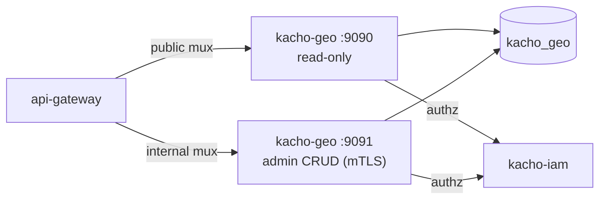

import CodeBlock from '@theme/CodeBlock'
import dedent from 'ts-dedent'

# Развёртывание

Эта страница описывает сборку Kachō Geo, применение миграций, два listener'а и контейнерный
образ. Ключи конфигурации (ENV `KACHO_GEO_*`) — на странице [Конфигурация](/install/configuration).

## Сборка

В репозитории две сборочные цели: API-сервер и отдельный бинарь миграций.

<CodeBlock language="bash">
  {dedent`
    # API-сервер → bin/kacho-geo
    make build

    # мигратор → bin/kacho-migrator
    make build-migrator
  `}
</CodeBlock>

Обе цели собирают статический бинарь (`CGO_ENABLED=0`).

## Миграции

Схема `kacho_geo` управляется goose-миграциями (встроены в бинарь через `embed.FS`).
Baseline-миграция `0001_initial` создаёт таблицы `regions`, `zones` (FK `RESTRICT`) и audit-
таблицу `geo_outbox` с LISTEN/NOTIFY-триггером. Применяются **отдельным** бинарём
`bin/kacho-migrator` (не самим сервисом на старте).

<CodeBlock language="bash">
  {dedent`
    # применить все миграции
    KACHO_GEO_DB_PASSWORD=secret bin/kacho-migrator up

    # статус
    KACHO_GEO_DB_PASSWORD=secret bin/kacho-migrator status

    # откат последней
    KACHO_GEO_DB_PASSWORD=secret bin/kacho-migrator down
  `}
</CodeBlock>

Те же шаги обёрнуты в Make-цели: `make migrate-up`, `make migrate-status`, `make migrate-down`.

:::warning Применённую миграцию не редактировать
Изменение топологии схемы — только новой миграцией. Уже применённый файл не редактируется
(конвенция Kachō). Подключение к БД задаётся ключами `KACHO_GEO_DB_*`.
:::

## Запуск — два listener'а

API-сервер поднимает два независимых gRPC-listener'а:

<table>
  <thead><tr><th>Listener</th><th>Порт (дефолт)</th><th>Поверхность</th></tr></thead>
  <tbody>
    <tr><td>public</td><td><code>:9090</code></td><td>Read-only: <code>RegionService</code> / <code>ZoneService</code></td></tr>
    <tr><td>internal</td><td><code>:9091</code></td><td>Admin CRUD: <code>InternalRegionService</code> / <code>InternalZoneService</code> (cluster-internal, mTLS)</td></tr>
  </tbody>
</table>

<CodeBlock language="bash">
  {dedent`
    KACHO_GEO_DB_PASSWORD=secret bin/kacho-geo serve
  `}
</CodeBlock>

Internal listener **не публикуется** на external endpoint — его REST-проекция в `api-gateway`
доступна только на cluster-internal mux. В production оба listener'а обязаны работать по mTLS,
а per-RPC authz-Check к kacho-iam — быть сконфигурированным (иначе сервис не стартует).

## Контейнерный образ

Сервис собирается в контейнер (build-context — родительская директория, чтобы подтянуть
sibling-репозитории по `replace ../`):

<CodeBlock language="bash">
  {dedent`
    make docker          # cd .. && docker build -f kacho-geo/Dockerfile -t kacho-geo:dev .
  `}
</CodeBlock>

При развёртывании в кластер мигратор обычно запускается отдельным job/init-контейнером
(`kacho-migrator up`) до старта сервиса, а сам сервис — как Deployment с двумя портами.

:::tip Дальше
Полный список ключей конфигурации, режимы `AUTH_MODE` и per-edge mTLS —
[Конфигурация](/install/configuration). Первые запросы к запущенному сервису —
[Быстрый старт](/getting-started).
:::
