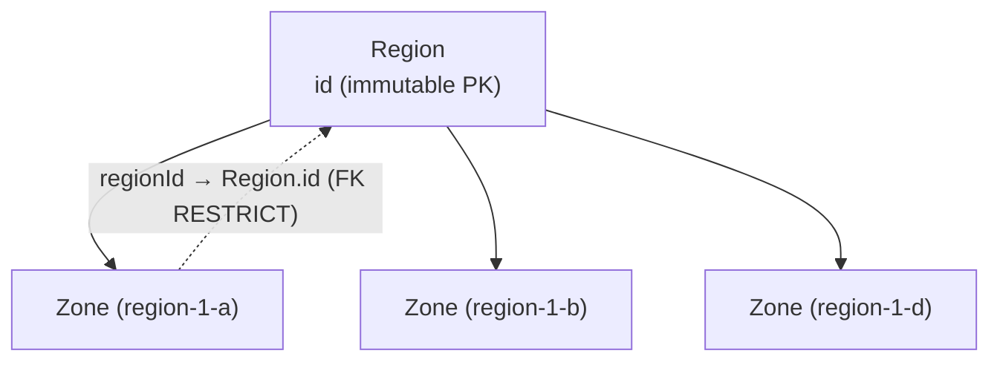
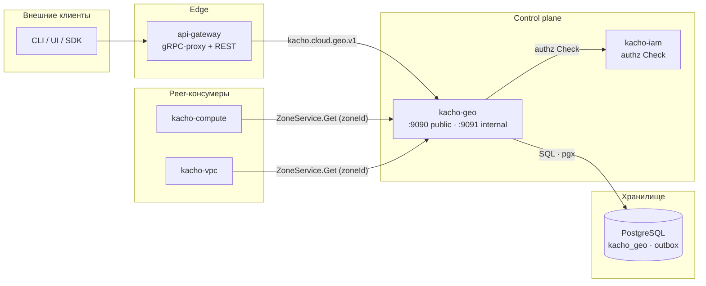

import hero from '@site/src/css/hero.module.css'

<header className={hero.hero}>
   Control-plane · Geography

  <h1 className={hero.title}>
    Топология платформы 
    Kachō
  </h1>

  

    gRPC + REST API, описывающий географию облака: <strong>Region</strong> (регион) и
    <strong>Zone</strong> (зона доступности). Единый источник истины о топологии для всех
    остальных сервисов платформы.
  

  

    <a className={hero.btnPrimary} href="/getting-started">Быстрый старт →</a>
    <a className={hero.btnGhost} href="/api/overview">Обзор API</a>
    <a className={hero.btnGhost} href="/architecture/overview">Архитектура</a>
    <a className={hero.btnGhost} href="https://github.com/PRO-Robotech/kacho-geo">GitHub</a>
  

</header>

## Что это и зачем

**Kachō Geo** — control-plane сервис домена **Geography**. Он отвечает за один простой, но
фундаментальный вопрос платформы: *какие регионы и зоны доступности существуют*. Region — это
верхнеуровневый географический элемент топологии, Zone — зона доступности внутри региона.
Оба — глобальные cluster-scoped справочники: они не принадлежат проекту или аккаунту, а
описывают саму инфраструктуру.

Бизнес-ценность в том, что **топология вынесена в собственный домен с единственным
владельцем**. Раньше понятие региона/зоны жило внутри вычислительного сервиса; теперь это
отдельный leaf-сервис, к которому обращаются все, кому нужно проверить `zoneId` или
`regionId`. Один источник истины — никакого дублирования таблиц регионов по сервисам, никакого
расхождения справочников. Вычислительные инстансы, подсети, балансировщики ссылаются на зону
по идентификатору и валидируют его через API Kachō Geo.

API следует **конвенциям Kachō**: плоские (flat) ресурсы, camelCase JSON, REST-пути
`/<service>/v1/<resource>`, единый формат ошибок `{code, message, details[]}`. Чтение —
синхронное; администрирование справочника — синхронные мутации (catalog-паттерн, см. ниже).

:::info Control-plane only
Kachō Geo управляет **описанием топологии** (какие регионы/зоны есть, их статусы). Это
control-plane: за физическое размещение нагрузок отвечают другие слои платформы. Эта
документация описывает control-plane API.
:::

:::tip С чего начать
Новому читателю — [**Быстрый старт**](/getting-started): пошагово от сборки и миграций до
первого запроса `RegionService.List` и `ZoneService.Get` через `curl`. Готовы к деталям —
[Обзор API](/api/overview) и [Архитектура](/architecture/overview).
:::

## Доменная модель

Kachō Geo управляет **двумя типами ресурсов**. Оба — «плоские» (flat): domain-поля на верхнем
уровне сообщения, без K8s-envelope. Region и Zone — read-only справочники: публичный API только
читает их, а наполняет каталог администратор через `Internal*`-сервисы.

<table>
  <thead>
    <tr><th>Ресурс</th><th>Назначение</th><th>Поверхность</th></tr>
  </thead>
  <tbody>
    <tr><td><strong>Region</strong></td><td>Верхнеуровневый элемент топологии (регион). id назначается администратором и неизменяем</td><td>public read · admin CRUD</td></tr>
    <tr><td><strong>Zone</strong></td><td>Зона доступности внутри региона; несёт <code>status</code> (UP / DOWN)</td><td>public read · admin CRUD</td></tr>
  </tbody>
</table>

:::note Идентификаторы — admin-assigned
Идентификаторы Region и Zone **назначает администратор** явно (например, `region-1`,
`region-1-a`), и они **неизменяемы** после создания (immutable PK). Это осознанное решение:
топология — стабильный справочник, её ключи человекочитаемы и постоянны (тогда как у обычных
ресурсов платформы id генерируется сервером через `kacho-corelib/ids`).
:::

### Связи ресурсов

Внутри сервиса связь `Zone.regionId → Region.id` защищена внешним ключом с
`ON DELETE RESTRICT`: регион, у которого есть зоны, удалить нельзя. Это within-service
инвариант на уровне БД (не software-проверка).

:::tip Порядок удаления — сначала зоны
FK-ограничение (`RESTRICT`) требует удалять зоны раньше региона: пока к региону привязана хотя
бы одна Zone, `InternalRegionService.Delete` вернёт `FAILED_PRECONDITION`. Сначала удаляются
зоны, затем регион.
:::

## Как с сервисом общаться

Kachō Geo — один из доменных сервисов платформы и её **leaf-узел**: он не зависит ни от
одного другого сервиса (по аналогии с IAM). Tenant-запросы на чтение проходят через
`api-gateway`; peer-сервисы (Compute, VPC и др.) зовут публичный listener напрямую для
валидации `zoneId` / `regionId`; admin-CRUD доступен только на cluster-internal listener.

Система построена по принципу **database-per-service**: kacho-geo владеет схемой `kacho_geo` и
общается с другими доменами только по API (никаких cross-service FK). Consumer-сервисы держат
`zoneId` / `regionId` как обычный текст и валидируют его через API Kachō Geo. Подробнее —
[Архитектура](/architecture/overview).

## Ключевые возможности

  

    ⇄
    gRPC + REST API
    Единый контракт на Protocol Buffers (<code>kacho-proto</code>), REST-проекция через grpc-gateway.
  

  

    ◎
    Источник истины топологии
    Единственный владелец Region/Zone; consumer'ы ссылаются по id и валидируют через API.
  

  

    ▤
    Sync-каталог
    Чтение синхронное; admin-мутации Region/Zone тоже синхронные — это reference-каталог, не LRO.
  

  

    ⛓
    FK RESTRICT на уровне БД
    <code>Zone.regionId → Region.id ON DELETE RESTRICT</code> — within-service инвариант в Postgres.
  

  

    🔑
    Авторизация на обоих портах
    Per-RPC authz Check через kacho-iam — и на public (:9090), и на internal (:9091).
  

  

    📓
    Audit-outbox в одной TX
    Admin-мутации атомарно пишут строку в <code>geo_outbox</code> в той же writer-транзакции.
  

## Технологический стек

<table>
  <thead><tr><th>Технология</th><th>Применение</th></tr></thead>
  <tbody>
    <tr><td>Go</td><td>Язык реализации (чистая архитектура: handler → use-case → domain)</td></tr>
    <tr><td>Protocol Buffers / Buf</td><td>Контракт API (<code>kacho-proto</code>, домен <code>kacho.cloud.geo.v1</code>)</td></tr>
    <tr><td>PostgreSQL / pgx v5</td><td>Хранилище <code>kacho_geo</code></td></tr>
    <tr><td>Goose</td><td>Версионирование схемы (baseline-миграция <code>0001_initial</code>)</td></tr>
    <tr><td>sqlc + handwritten pgx</td><td>SQL-доступ (без ORM)</td></tr>
    <tr><td>OpenFGA (ReBAC)</td><td>Авторизация — per-RPC Check через kacho-iam</td></tr>
    <tr><td>grpc-gateway</td><td>REST-проекция gRPC</td></tr>
  </tbody>
</table>

## Структура репозиториев

<table>
  <thead><tr><th>Репозиторий</th><th>Назначение</th></tr></thead>
  <tbody>
    <tr><td><strong>kacho-geo</strong></td><td>Этот сервис: control-plane Geography (Region / Zone)</td></tr>
    <tr><td><strong>kacho-proto</strong></td><td>Центральные <code>.proto</code> + сгенерированные Go-stubs</td></tr>
    <tr><td><strong>kacho-corelib</strong></td><td>Общие пакеты (db, grpcsrv, grpcclient, config, observability, ...)</td></tr>
    <tr><td><strong>kacho-api-gateway</strong></td><td>Edge: gRPC-proxy + REST mux</td></tr>
    <tr><td><strong>kacho-iam</strong></td><td>Авторизация — per-RPC Check (ребро geo → iam)</td></tr>
    <tr><td><strong>kacho-compute / kacho-vpc</strong></td><td>Peer-консумеры: валидируют <code>zoneId</code> / <code>regionId</code> через Kachō Geo</td></tr>
  </tbody>
</table>
